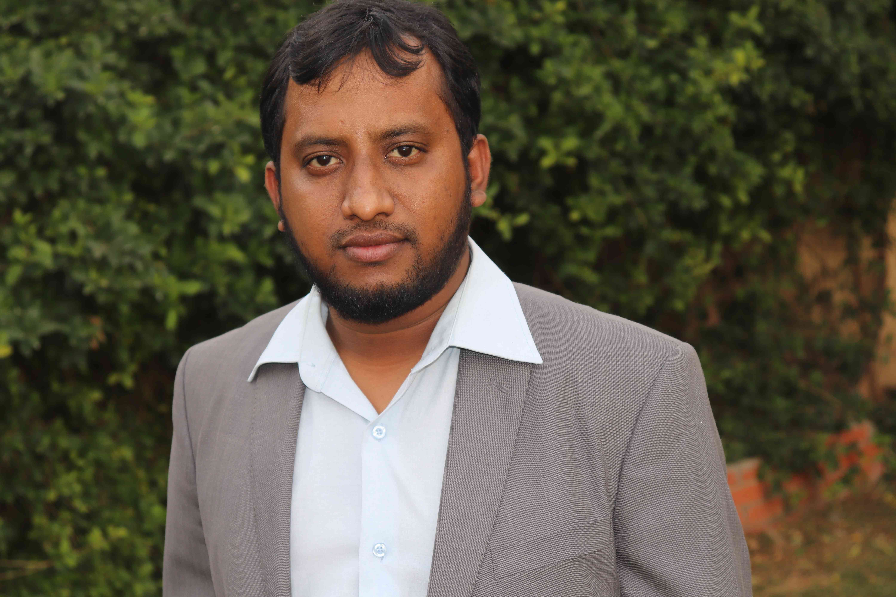
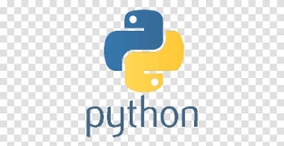

<!-- banner image starts here  -->

<!-- banner image ends here  -->

<h1> 👋 Hello, I'm Tariqul Islam </h1>

A full time content creator on & web developer  
🏠 &nbsp; Living: Riyadh, KSA

<!-- Contact me section starts here  -->

[][website]
[][youtube]
[][facebook]
[][linkedin]
 
 

<!-- Contact me section ends here  -->

<!-- about-me section starts here  -->

### 👨‍🏫 &nbsp; About Me

I am Tariqul Islam Web Designer,Web Developer,Public Speaker,Business analyst,Co-founder and CEO at Matjel ltd.

I talk about Education, Skills & Happiness!

I provide Business Idea, Business plan,Business Startup Help,Business Motivation, I love to create documentary video, Business Finance & How to Grow your Business with Low investment,Business tips & help for starting and growing your business.

Our Mission: To help people learning business education and technology .
Our Vision: To inspire people to become self dependent and self employed by improving and using their own skill set.

 
<!-- about-me section ends here  -->

<!-- web related skills section starts here  -->

### 👨🏽‍💻 &nbsp; My Skills & Videos:

#### Key Skills & Videos on Web development:

 
 
 

<!-- web related skills section ends here  -->
<!-- other skills and my videos for computer science section starts here  -->

#### Other Skills & Videos:

 
 
 

- [Artificial Intelligence (English)][aienglishplaylist]
- [Artificial Intelligence (Bangla)][aibanglaplaylist]
- [Java Swing][javaswingplaylist]
- [Discrte Math][dsplaylist]
- [Numerical Method][numericalplaylist]
- [Theory of computation][tocplaylist]
- [Compiler][compilerplaylist]
- [Networking][networkingplaylist]
- [Operating System][operatingsystemplaylist]
- [HSC ICT][hscictplaylist]
- [Learn for skill][learnforskillplaylist]
- [MS Word][mswordplaylist]
- [MS Excel][msexcelplaylist]
- [MS powerpoint][mspowerpointplaylist]
  <!-- other skills and my videos for computer science section ends here  -->

   

<!-- github stats starts here  -->

<!--  -->

 

<!-- github stats ends here  -->
  <!-- latest youtube videos starts here -->

#### 📹 &nbsp; My Latest YouTube Videos

<!-- YOUTUBE:START -->
- 
- 
- 
- 
- 
<!-- YOUTUBE:END -->

↪️ &nbsp; [search more videos...]( https://www.youtube.com/c/MatjelAcademy)

 

<!-- latest youtube videos ends here -->

<!-- other skills and my videos for computer science section starts here  -->

<!-- work experience section starts here  -->

### 💼 &nbsp; Employment History

| Position            | Institute                                   | Duration            | Location           |
| ------------------- | ------------------------------------------- | ------------------- | ------------------ |
| Courier (Part-time) |                                 | Oct 2019- Running   |    |
| Research Assistant  |                          | Nov 2020 - Jan 2021 |    |
| Lecturer of ICT     |              | Jul 2018 – Nov 2018 |  |
| Guest Lecturer      |                  | Nov 2017 – Apr 2018 |  |
| Android developer   | | Nov 2016 – Nov 2017 |  |

 
<!-- work experience section ends here  -->
<!-- education section starts here  -->

### 👨🏻‍🎓 &nbsp; Education

1. B.Sc. in Computer Science & Engineering  
   University of the people
   On going.
2. Professional Diploma in Power enginerring  
   Khulna Bangladesh.
   

 

<!-- education section ends here  -->

<!-- my languages section starts here  -->

### Languages:

- 🇧🇩 Bangla : Native
- 🏴󠁧󠁢󠁥󠁮󠁧󠁿 English : Intermediate
- 🇮🇳 Hindi : Intermediate
- Ar Aribic : Intermediate
   

<!-- my languages section ends here  -->

<!-- my sports and game section starts here  -->

### Sports / Game / Activities / Hobby:

- 🏏 Cricket, ⚽ Football, 🏸 Badminton, ♟️ Chess, 🏐 Volleyball
- 🏊‍♂️ Swimming, 🏃‍♂️ Running, 🚶‍♂️ Walking
- ✈️ Travelling

 
<!-- my sports and games section ends here  -->

<!-- Honors & awards section starts here  -->

### 🏅 Honors & Awards :

-
- 

---

Thanks for going through my Portfolio.
All rights reserved by Tariqul Islam @2022

---

<!-- my achievement section ends here  -->

<!-- Links section starts here -->

[website]: http://engrtariqul.me/
[youtube]:  https://www.youtube.com/c/MatjelAcademy
[facebook]: https://www.facebook.com/Engrtariqulislambd/
[linkedin]: https://www.linkedin.com/in/md-tariqul-islambd/
[github]: https://github.com/tnawayn83

<!-- web related playlists starts here  -->

<!-- web related playlists ends here  -->

<!-- cse related playlists starts here  -->

<!-- cse related playlists ends here  -->

<!-- Links section ends here -->
